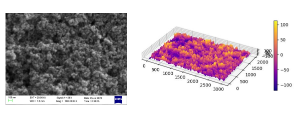
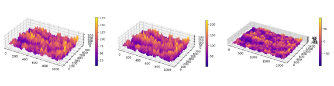
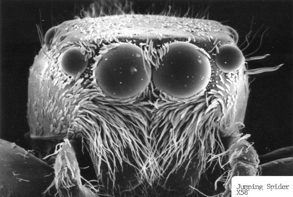

# 3D-representation-of-a-SEM-images

• Utilized Python libraries such as NumPy and Matplotlib to load and manipulate SEM images.

• The intensity of darkness observed in scanning electron microscopy (SEM) images serves as a qualitative indicator of depth.

# Challenges 

1. The visualization varies depending on our depth estimation. Currently, there is no algorithm available to determine it.

2. Due to the emission of electrons in all directions, fine details tend to appear brighter, which is why the spider’s hairs are almost white in below image. It suggests that pixel values may not provide valuable structural information

I possess limited knowledge of SEM imaging, and consequently, I may not fully comprehend the appropriate course of action to take in this context.

A Spider’s head

Filament of a Tungsten Lightbulb

Human Eyelashes

Raw Sugar Crystals

Source:  [30 Of the Most Amazing Images from Electron Microscopes](http://favoritethings.danoah.com/30-of-the-most-amazing-images-from-electron-microscopes/)

## Collaborators

- Prof. T.M.W.J. Bandara - Ph.D.(Perad.), M.Phil. (Perad.), 
B.Sc. (Ruhuna), 

- Mr. W.M.I.U.Rathnayake

- Mr. I.M.G. Janindu Eranga
